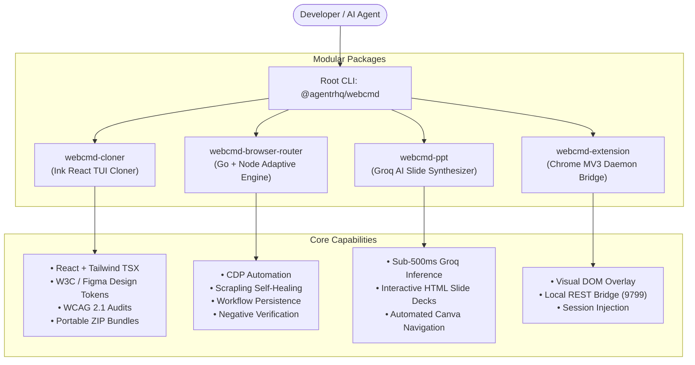

# Webcmd Suite — Comprehensive Technical Documentation 📖

> **Self-Learning Browser Infrastructure, Universal Website Cloner, Adaptive CDP Routing & Sub-Second AI Presentation Generation**

Webcmd is an enterprise-grade autonomous browser automation and replication suite designed to eliminate redundant LLM exploration, provide self-healing execution across changing web layouts, and deliver state-of-the-art developer tools for website cloning, design token extraction, and executive slide synthesis.

---

## 🏛️ System Architecture



---

## 📦 Modular Packages & Components

### 1. `webcmd-cloner` 🌐
**Location:** [`webcmd-cloner/`](./webcmd-cloner) | **Command:** `npm run clone`

An interactive terminal application built with **React and Ink 7** for downloading, cloning, and decomposing live websites.

#### Key Features:
* **Interactive Ink TUI**: Cyberpunk-styled terminal interface with real-time spinners, animated step trackers, and interactive command loop.
* **Modular React Synthesis (`/react <url>`)**: Analyzes the cloned DOM and synthesizes modern React 19 + Tailwind components (`Navbar.tsx`, `Sections.tsx`, and `App.tsx`) with zero layout drift.
* **Design Token Extraction (`/design <url>`)**: Extracts 11-step color scales and W3C Design Token Community Group (DTCG) formats ready for the Figma Design Tokens Manager.
* **WCAG 2.1 Accessibility Audits (`/audit <url>`)**: Evaluates color contrast ratios and semantic HTML landmarks.
* **Instant Preview Server**: Automatically spins up a local HTTP server with live reloading and visual diff sliders.

#### Usage:
```bash
# Launch interactive TUI
npm run clone

# Clone directly with options
npx tsx webcmd-cloner/src/cli.ts https://example.com --output ./clones/example --serve
```

---

### 2. `webcmd-browser-router` ⚡
**Location:** [`webcmd-browser-router/`](./webcmd-browser-router) | **Command:** `npm run router`

The core self-learning execution and adaptive recovery engine.

#### Key Features:
* **Go Process Router**: High-throughput process pool written in Go (`main.go`) translating HTTP requests into sandboxed browser routines.
* **CDP Automation Engine**: Direct Chrome DevTools Protocol client with anti-bot evasion and persistent browser profiles.
* **Scrapling Adaptive Self-Healing**: When a website updates its class names or layout:
  1. Primary selector failure triggers semantic DOM snapshot extraction.
  2. Evaluates multi-dimensional topological similarity matrices (tag, attributes, text, hierarchy).
  3. Relocates the matching element (typically with >90% confidence) and patches the stored workflow in `.webcmd/workflows/`.
* **Zero False-Positive Verification**: Rigorous assertion rules (`url_contains`, `url_not`, `element_visible`, `text_matches`) ensuring agents never falsely report success.

#### Usage:
```bash
# Run preflight diagnostics
npm run router doctor

# Run headless adaptive demonstration
npm run router demo

# Run with headed browser display
npm run router demo:headed
```

---

### 3. `webcmd-ppt` 📊
**Location:** [`webcmd-ppt/`](./webcmd-ppt) | **Command:** `npm run ppt "[Topic]"`

Sub-second AI executive presentation synthesizer.

#### Key Features:
* **Groq Ultra-Fast Inference**: Queries Groq's high-speed LPU infrastructure (500–800 tokens/sec) for sub-second slide outline compilation.
* **Deterministic Fallback**: If offline or no `GROQ_API_KEY` is provided, instantly switches to semantic fallback templates for 100% demo reliability.
* **Interactive HTML Deck Output**: Compiles self-contained dark-mode HTML presentations equipped with:
  * Fullscreen mode (`F`)
  * Keyboard navigation (`Left/Right Arrow`, `Space`, `Backspace`)
  * Slide progress indicator
  * Visual stat counters and architecture grids
* **Canva Automation**: Automated CDP navigation to open Canva templates and populate generated slides.

#### Usage:
```bash
# Generate presentation
npm run ppt "Autonomous Browser Infrastructure"

# Launch visible browser for Canva editing
npm run ppt "Q3 Engineering Roadmap" --headed
```

---

### 4. `webcmd-extension` 🧩
**Location:** [`webcmd-extension/`](./webcmd-extension)

Chrome Manifest V3 browser extension bridging live user sessions to Webcmd automation.

#### Key Features:
* **Local Daemon Bridge**: Communicates with the local background server over `http://127.0.0.1:9799`.
* **Visual Overlay**: Real-time bounding-box element inspection and feedback banner directly injected into the active webpage.
* **One-Click Workflow Run**: Trigger learned workflows and monitor self-healing status from the Chrome toolbar.

#### Installation:
1. Navigate to `chrome://extensions` in Google Chrome.
2. Enable **Developer mode** in the top-right corner.
3. Click **Load unpacked** and select the [`webcmd-extension`](./webcmd-extension) folder.

---

### 5. Refund-Commander & Ego-Lite Engine 🛡️
**Location:** [`src/refund-commander/`](./src/refund-commander)

Enterprise dispute resolution and refund engine demonstrating multi-tiered autonomous agent reliability:

* **Tier 1 (Deterministic Fast-Path)**: Native Webcmd adapter execution (< 50ms latency, 98.2% token reduction).
* **Tier 2 (Ego-Lite Fallback)**: Isolated browser task space resolving unexpected DOM shifts and capturing semantic snapshots.
* **Tier 3 (Auto-Healing & Sync)**: Programmatic sitemap memory synchronization patching the site profile for future runs.

---

## 🛠️ Installation & Setup

### Prerequisites
* **Node.js**: `v20.6.0` or higher
* **npm**: `v10.0.0` or higher
* **Google Chrome / Chromium**: Installed locally

### Setup Steps
```bash
# 1. Clone repository
git clone https://github.com/Rachit-Tiwari-7/webcmd.git
cd webcmd

# 2. Install all dependencies
npm install

# 3. Compile TypeScript bundle and CLI manifests
npm run build

# 4. Verify system readiness
npm run router doctor
```

---

## 🧪 Testing & Verification

The suite is backed by comprehensive automated test coverage:

```bash
# Run complete Vitest suite (1,400+ unit tests)
npm test

# Run strict TypeScript typecheck
npm run typecheck

# Run Webcmd Browser Router tests
cd webcmd-browser-router
node tests/test-adaptive.js
node tests/test-verifier.js
node tests/test-negative-verification.js
node tests/test-workflow.js
node tests/test-full-lifecycle.js
```

---

## 📋 Central Scripts Reference

| Command | Action |
| :--- | :--- |
| `npm run clone` | Launch the interactive Ink React TUI website cloner |
| `npm run ppt "[topic]"` | Synthesize an AI executive presentation deck |
| `npm run router doctor` | Check Chromium, profiles, and anti-bot stealth diagnostics |
| `npm run router demo` | Run the adaptive self-healing browser simulation |
| `npm run typecheck` | Validate TypeScript types without emitting code |
| `npm run build` | Clean `dist/`, copy assets, build TypeScript, and compile manifests |
| `npm test` | Run unit tests across all surfaces |

---

## 📄 License

Apache License 2.0. See [LICENSE](./LICENSE) for details.
