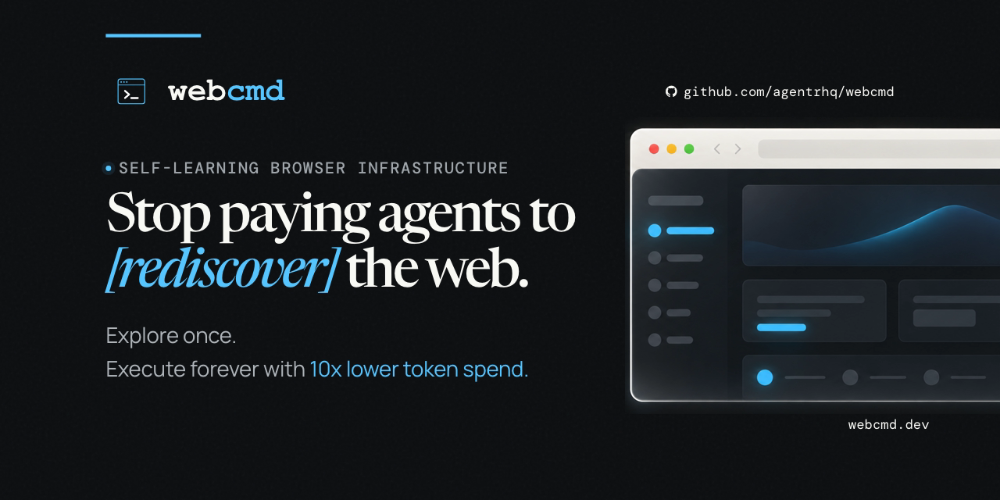
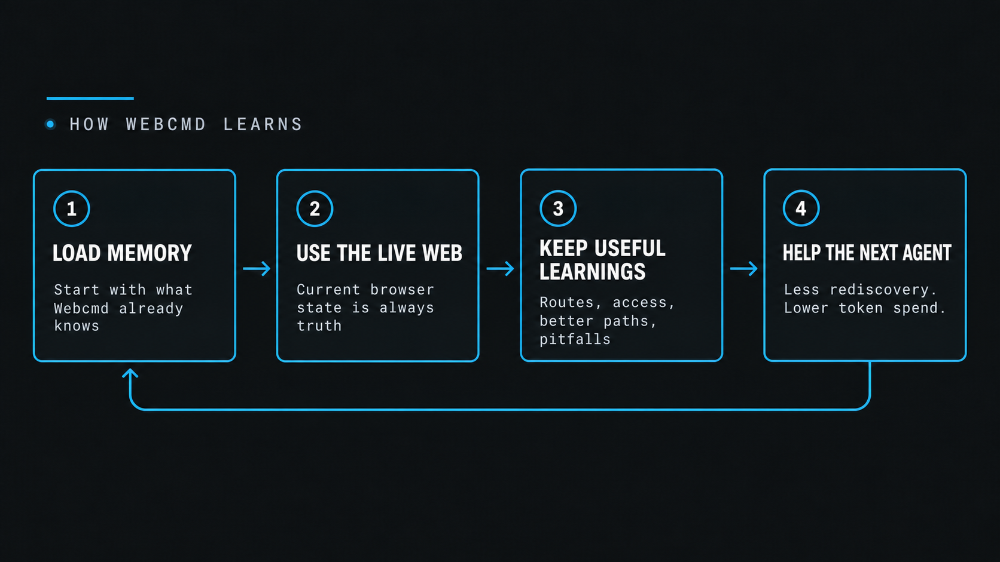
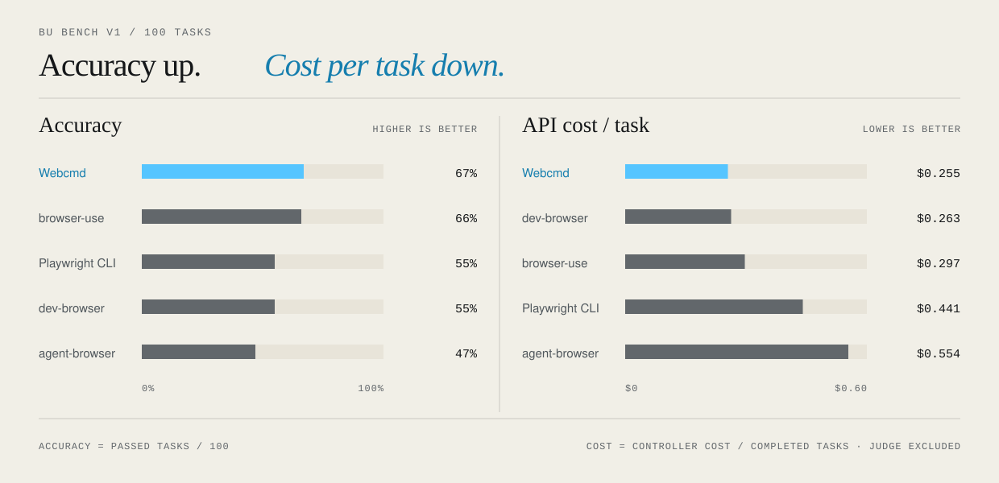

<p align="center">
  <a href="https://www.npmjs.com/package/@agentrhq/webcmd">
    
  </a>
  <a href="https://webcmd.dev/docs">
    
  </a>
  <a href="https://github.com/agentrhq/webcmd/blob/main/LICENSE">
    
  </a>
  <a href="https://discord.gg/9YP2C9tvMp">
    
  </a>
  <a href="https://x.com/agentrhq">
    
  </a>
</p>

# Webcmd

**Self-learning browser infra for AI agents.**

Webcmd learns the navigational context of websites as agents use them, then
turns that knowledge into local memory for faster, cheaper, more reliable
browser automation. The goal is simple: stop making agents rediscover the same
sites on every run and cut browser-agent token spend by up to 90%.

Webcmd pairs live browser control with a self-learning memory layer:

| Layer | Scenario | What Webcmd Helps With |
| --- | --- | --- |
| 0. Live browser control | The site is unfamiliar. | Use `webcmd browser` to inspect, click, type, extract, capture network calls, and complete the task in a real browser. |
| 1. Sitemap memory | The site is familiar, but the action space is not fully known. | Capture an agent-facing sitemap of observed pages, states, actions, workflows, APIs, pitfalls, and fallback paths. |

## How Self-Learning Works



Learning stays quiet and selective: the live browser is always truth, Webcmd
never explores just to learn, and a memory failure never blocks the task. First
access may use a Webcmd Cloud seed; subsequent learning stays local.

For local, multi-step browser exploration, agents can send one sandboxed
Playwright-style program to an explicit browser session:

```bash
webcmd --profile work session create "Work Project" -f json
# id: work-project-k7
webcmd --profile work --session work-project-k7 browser tabs
webcmd --profile work --session work-project-k7 browser run --file explore.js
printf 'return await page.title();' \
  | webcmd --profile work --session work-project-k7 browser run --stdin
webcmd --profile work session close work-project-k7
```

Profiles are cookie jars; Sessions are independent browser windows within a
profile, so Session IDs are immutable, Profile-scoped, and safe to reuse for
that Session's lifetime. Parallel agents should create separate Sessions.
Raw browser commands require an explicit readable Session ID.

## Demo

https://github.com/user-attachments/assets/04eceadc-d398-4303-984d-ae3197bfa664

## Quick Start

### Agent prompt

```text
Fetch and follow https://raw.githubusercontent.com/agentrhq/webcmd/main/start.md to set up Webcmd end to end.
```

### Manual

Webcmd requires Node.js 20.6+.

```bash
npm install -g @agentrhq/webcmd
webcmd skills add
```

When prompted, choose Claude, Codex, another supported harness, or a custom
skills path. That installs exactly one skill, `webcmd-browser`.

Load or tag `webcmd-browser` only for live browser work, then describe the
outcome you want. Installation and setup commands do not require that skill.

```text
Use webcmd to research the latest discussions about browser automation across Hacker News and Reddit, then return a concise comparison with source links.
```

## What You Can Ask

- “Use webcmd to research agentic browser automation on PubMed and return the title, authors, publication date, abstract, and URL for each result.”
- “Use webcmd to find active AI infrastructure companies in the YC company directory and return the company, batch, description, location, profile URL, and source links. Keep it read-only.”
- “Use webcmd to look up parts on Grainger by part number and return price, stock, minimum order quantity, lead time, and product URL.”
- “Use webcmd with my logged-in `work` profile to summarize unread LinkedIn messages from the last seven days and return the sender, subject or opening text, received time, and conversation URL.”
- “Use webcmd to check Grainger part prices and SAP Ariba purchase-order status, then return a combined summary.”

## See It in Action

```text
Use webcmd with my logged-in `social` profile to collect my recent X bookmarks and return the author, text, and URL.
```

The agent uses the logged-in profile to complete the task in a real browser.
Along the way, Webcmd quietly retains useful navigation context so later agents
can avoid repeating the same exploration.

## Where Webcmd Works

Webcmd can work through authenticated browser sessions across research, social,
AI, shopping, and booking products.

| Group | Supported surfaces | Representative outcomes |
| --- | --- | --- |
| research and communities | Hacker News, Reddit, PubMed | Compare current discussions, find primary research, and return concise summaries with source links. |
| social and professional | X/Twitter, LinkedIn, TikTok | Collect bookmarks, monitor public posts, or research people and creators with a named profile when needed. |
| AI tools | ChatGPT, Claude, Gemini, NotebookLM | Retrieve conversations, research outputs, notebooks, and generated materials from the tools you already use. |
| shopping and bookings | Amazon, Blinkit, Zepto, BigBasket, District, Practo | Compare products, availability, prices, appointments, events, and delivery options. |

This list is illustrative. Webcmd can operate other websites through the same
live browser workflow.

## Benchmarks

On [BU Bench V1](https://github.com/browser-use/benchmark#bu-bench-v1), a
100-task browser automation benchmark, Webcmd recorded the highest accuracy and
lowest estimated controller cost per completed task, and fewest agent turns per
completed task in this comparison.



All tools used the same Pi controller, controller model, Codex `gpt-5.4` judge,
and CloakBrowser engine. This is a stronger judge than the original BU Bench
setup, whose [current runner uses Gemini 2.5 Flash](https://github.com/browser-use/benchmark/blob/main/run_eval.py#L37-L38).
Accuracy is passed tasks out of 100. Cost and agent turns are averaged over
completed tasks; cost excludes judge usage. See the
[benchmark report](./benchmarks/README.md) for category results, methodology,
architectural analysis, and reproduction steps.

## Learn More

Webcmd Cloud can run supported commands and browser sessions on hosted infrastructure. It is in active development and is not yet stable.

- [Prompt Cookbook](https://webcmd.dev/docs/agent-prompts)
- [How Webcmd Works](https://webcmd.dev/docs/concepts)
- [Local or Cloud](https://webcmd.dev/docs/local-or-cloud)
- [Command Surface](https://webcmd.dev/docs/cli-reference)

## Contributing

See [CONTRIBUTING.md](./CONTRIBUTING.md).

## License

Released under the terms in [`LICENSE`](./LICENSE).
