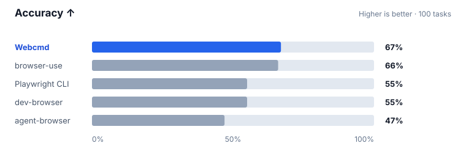
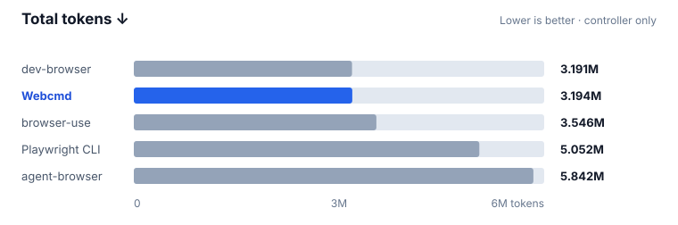
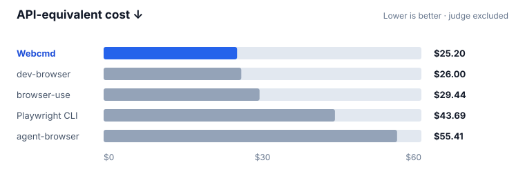
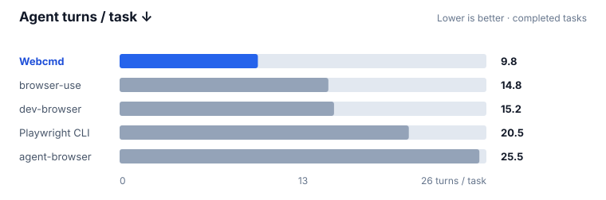

# BU Bench: Browser Agent Accuracy and Efficiency

Webcmd had the highest accuracy, lowest API-equivalent cost, and fewest agent
turns in this controlled 100-task comparison. It did this while using almost
the same number of tokens as dev-browser, the lowest-token run.

## Results

| Tool | Accuracy ↑ | Total tokens ↓ | Cost ↓ | Agent turns ↓ |
| --- | ---: | ---: | ---: | ---: |
| **Webcmd** | **67%** | 3,193,816 | **$25.20** | **969** |
| browser-use | 66% | 3,546,443 | $29.44 | 1,465 |
| Playwright CLI | 55% | 5,051,931 | $43.69 | 2,034 |
| dev-browser | 55% | **3,190,822** | $26.00 | 1,504 |
| agent-browser | 47% | 5,842,027 | $55.41 | 2,550 |

Accuracy is the number of tasks passed out of 100. Total tokens include
non-cached controller input and controller output. Cost is an API-equivalent
estimate for the controller; it does not include the judge.

### Accuracy



Webcmd passed one more task than browser-use and 12 more than Playwright CLI or
dev-browser. Three changes worked together here: `browser run` executes related
browser steps as one code-based workflow, snapshot pruning keeps important page
state within a smaller context, and task-aware diffs show useful changes without
requiring another full snapshot. The sections below explain each change in more
detail. The final system passed 67 tasks.

### Total tokens



Webcmd used 2,994 more tokens than dev-browser—a 0.09% difference—while
using 10% fewer than browser-use. We found that full snapshots often repeated
large sections of page state that had not changed. Simply cutting snapshots
shorter could remove a control or piece of context needed for the next action.
The goal was therefore to keep the useful parts, not just make every snapshot
smaller.

Webcmd first removes structural wrappers, duplicated labels, and background
content hidden behind an open modal. It then fills the remaining character
budget by priority: focused or invalid fields and alerts come first, followed
by actionable controls, repeated records such as list items and table rows,
named sections, and finally lower-value text. Repeated records are covered
breadth-first, so the agent sees each result before receiving extra detail about
the first few. When something must be omitted, Webcmd keeps the minimum parent
context and adds a recoverable `[more ref=...]` marker instead of silently
cutting the snapshot.

`browser run` also compares the page before and after a program and returns a
structural diff. This was very useful for form filling: after a click or input,
the agent could immediately see changed values, validation messages, dialogs,
and newly available controls without taking another full snapshot. Research
tasks behaved differently. Opening a content-heavy page could use most of the
65,536-character output ceiling on a large diff, but that text rarely contained
the exact evidence the agent needed. The agent still searched within the page—the
equivalent of using Ctrl+F—so much of the diff went unused.

We therefore added the optional `--no-snapshot-diff` flag. Form-filling tasks
keep the automatic diff, while research tasks can skip it and return only the
targeted evidence they found. We reran the research tasks to confirm the gain,
then reran the form-filling tasks to make sure this choice did not introduce a
regression. The final system finished within 0.1% of the lowest-token run.

### API-equivalent cost



We found that the total token count did not tell the full cost story. Webcmd used
slightly more tokens than dev-browser, but repeated input can be cached while
generated output is more expensive. This led us to keep repeated context stable
and make the agent's output more compact, rather than focusing only on the
overall token count.

Snapshot pruning and the code-based executor helped reuse more input context
across turns while producing less output. Webcmd generated 190,044 output tokens
versus dev-browser's 247,416—23% fewer—and recorded 8.96M cached input reads. In
the benchmark's GPT-5.6 pricing model, output costs 6× non-cached input and 60×
cached input. This gave Webcmd the lowest estimated cost, at $25.20, despite the
0.09% difference in total tokens.

### Agent turns



Webcmd completed the suite in 969 turns, 34% fewer than the next-best result.
Controlling a browser one command at a time turns even a predictable workflow
into a long sequence of click, wait, inspect, and decide. The model must process
each result before it can issue the next command, which adds round trips and
increases the chance that an earlier observation becomes stale.

`browser run` replaces that sequence with one Playwright-style JavaScript
program. A program can combine locators, navigation, waits, input, clicks,
frames, popups, response capture, and targeted extraction while keeping its
intermediate values in local variables. It returns compact, JSON-compatible
evidence when the workflow is complete. Each run uses a fresh QuickJS sandbox,
while the page and browser session remain available for the next run. This keeps
execution isolated without making the agent rebuild browser state.

The result is fewer model-to-browser round trips and fewer repeated snapshots.
Together with automatic diffs for interactive work, this brought the final turn
count down to 969, compared with 1,465 for browser-use.

## Category results

Each category contains 20 tasks. Values below are passed tasks divided by 20.

| Category | Webcmd | browser-use | Playwright CLI | dev-browser | agent-browser |
| --- | ---: | ---: | ---: | ---: | ---: |
| BrowseComp | **95%** | 85% | 80% | 75% | 75% |
| GAIA | 55% | **60%** | 50% | 40% | 40% |
| InteractionTests | 90% | **95%** | **95%** | 90% | 70% |
| OM2W2 | **40%** | **40%** | 20% | 25% | 15% |
| WebBenchREAD | **55%** | 50% | 30% | 45% | 35% |

Webcmd's strongest results were on BrowseComp and WebBenchREAD. browser-use led
GAIA; browser-use and Playwright CLI led InteractionTests; and Webcmd tied with
browser-use on OM2W2.

## Experimental setup

| Setting | Value |
| --- | --- |
| Harness | Pi `0.80.6` |
| Controller model | `openai-codex/gpt-5.6-sol` |
| Reasoning effort | `low` |
| Benchmark | `BU_Bench_V1` |
| Tasks | 100: 20 each from BrowseComp, GAIA, InteractionTests, OM2W2, and WebBenchREAD |
| Judge | Codex `gpt-5.4` |
| Judge rubric | [Completion-based browser-agent rubric](references/judge-contract.md) |
| Task timeout | 1,800 seconds |
| Execution | One tool per run; tasks executed sequentially |
| Browser engine | CloakBrowser for every tool |
| Isolation | Task-local Cloak profiles for competitors; a fresh Webcmd Session in the shared `benchmark` Profile |

Every tool used CloakBrowser, which keeps the browser engine and stealth runtime
consistent across the comparison. One setup detail differs: competitors use a
separate profile for each task, while Webcmd creates a fresh Session inside one
shared `benchmark` Profile. The harness records the dataset hash, component
versions, configuration, evidence for each task, and aggregate metrics in every
run manifest. The complete Webcmd run is available in
[`agentrhq/evals-run`](https://github.com/agentrhq/evals-run).

The published figures are end-to-end results from one complete run per tool.
They show the combined system rather than the standalone effect of any one
change, and are not repeated trials with confidence intervals.

## Run the benchmark

Run these commands from the repository root. The plaintext BU Bench dataset is
intentionally not committed. Please obtain an authorized copy, place the
100-task array at `benchmarks/datasets/BU_Bench_V1.json`, and do not publish it.
The runner records its SHA-256 in the run manifest. See
[`references/dataset-provenance.md`](references/dataset-provenance.md) before
using or sharing benchmark data.

Install the pinned harness and Python dependencies, then authenticate Pi and
the Codex judge:

```bash
npm --prefix benchmarks ci --ignore-scripts
uv sync --project benchmarks --all-groups
./benchmarks/node_modules/.bin/pi
# In Pi: /login → OpenAI Codex, then exit.
codex login
```

Install the evaluated tool versions and their skills. The harness connects every
browser runtime to CloakBrowser, so please use that browser for each run.

```bash
npm install -g \
  @agentrhq/webcmd@0.7.3 \
  dev-browser@0.2.9 \
  agent-browser@0.34.0 \
  @playwright/cli@0.1.18
uv tool install --python 3.12 browser-use==0.13.8

webcmd skills add --provider codex --scope user
dev-browser install
dev-browser install-skill --codex
browser-use skill install
playwright-cli install --skills=agents --global

mkdir -p ~/.codex/skills/playwright-cli
cp -R ~/.agents/skills/playwright-cli/. ~/.codex/skills/playwright-cli/

mkdir -p ~/.codex/skills/agent-browser
curl -fsSL -o ~/.codex/skills/agent-browser/SKILL.md \
  https://raw.githubusercontent.com/vercel-labs/agent-browser/548b159b30eef119ccf6846c8bc807d0eaa3f6f8/skills/agent-browser/SKILL.md
```

Choose one tool and run the full suite, then repeat with `browser-use`,
`playwright-cli`, `dev-browser`, and `agent-browser`.

```bash
benchmark_tool=webcmd

uv run --project benchmarks python benchmarks/scripts/run_eval.py \
  --controller pi \
  --model openai-codex/gpt-5.6-sol \
  --reasoning-effort low \
  --benchmark BU_Bench_V1 \
  --tasks all \
  --tools "$benchmark_tool" \
  --judge-provider codex \
  --judge-model gpt-5.4
```

Results are written to `benchmarks/results/<run-id>/`. Before comparing runs,
make sure their manifests have matching dataset hashes, controller settings, and
judge settings. Please record every tool and browser version. Competitor
manifests include CloakBrowser directly, while Webcmd's bundled version comes
from the pinned npm package. Review transcripts and screenshots for private
account data before publishing.

For audit details, read [`references/judge-contract.md`](references/judge-contract.md)
and [`references/dataset-provenance.md`](references/dataset-provenance.md).
