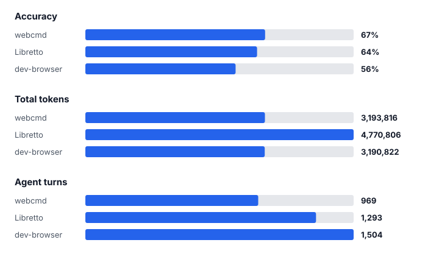

# Pi Browser Benchmark Comparison

BU Bench results from the Pi harness with the same model and judge configuration.



API-equivalent cost: webcmd **$25.20** · Libretto $35.40 · dev-browser $26.00.

**Best in class:** accuracy → webcmd · tokens → dev-browser · agent turns → webcmd · cost → webcmd

The complete webcmd run is available [here](https://github.com/agentrhq/evals-run).

## Evaluation configuration

| Setting | Value |
|---|---|
| Harness | Pi |
| Controller model | `openai-codex/gpt-5.6-sol` |
| Reasoning effort | `low` |
| Benchmark | `BU_Bench_V1` |
| Judge provider | Codex |
| Judge model | `gpt-5.4` |

Accuracy is the percentage of benchmark tasks that passed. Token, turn, and
cost values are recorded controller totals. Cost is an API-equivalent estimate;
judge usage is excluded.

## Reproduce and verify

All three results use the configuration above. Run from the repository root.

First install the pinned benchmark dependencies and authenticate Pi:

```bash
npm --prefix benchmarks ci --ignore-scripts
./benchmarks/node_modules/.bin/pi
# In Pi, run /login, select OpenAI Codex, then exit.
```

Pi reads the resulting credentials from `~/.pi/agent/auth.json`. Preflight
verifies the credentials, benchmark dependencies, and selected browser tool
before starting a task.

### webcmd

```bash
webcmd skills add --provider codex --scope user

uv run python benchmarks/scripts/run_eval.py \
  --controller pi \
  --model openai-codex/gpt-5.6-sol \
  --reasoning-effort low \
  --benchmark BU_Bench_V1 \
  --tasks all \
  --tools webcmd \
  --judge-provider codex \
  --judge-model gpt-5.4
```

### dev-browser

```bash
npm install -g dev-browser
dev-browser install
dev-browser install-skill --codex

uv run python benchmarks/scripts/run_eval.py \
  --controller pi \
  --model openai-codex/gpt-5.6-sol \
  --reasoning-effort low \
  --benchmark BU_Bench_V1 \
  --tasks all \
  --tools dev-browser \
  --judge-provider codex \
  --judge-model gpt-5.4
```

The Pi sidecar mounts the installed `dev-browser` skill and enables only its
`bash` and `read` tools. The benchmark connects it to the task's dedicated
CloakBrowser CDP endpoint.

### Libretto Browser Tools

```bash
uv run python benchmarks/scripts/run_eval.py \
  --controller pi \
  --model openai-codex/gpt-5.6-sol \
  --reasoning-effort low \
  --benchmark BU_Bench_V1 \
  --tasks all \
  --tools libretto \
  --judge-provider codex \
  --judge-model gpt-5.4
```

Pi registers the pinned Libretto browser tools directly:
`browser_open`, `browser_exec`, `browser_snapshot`, `browser_status`, and
`browser_close`. `browser_connect` is disabled so the agent cannot leave the
task's dedicated CloakBrowser.

## Verify a run

Each run writes a manifest, aggregate summary, per-task result, transcript, and
screenshots under `benchmarks/results/<run-id>/`. Before comparing tools, verify
that their manifests use the same dataset hash, controller, model, reasoning
effort, and judge configuration.

Review transcripts and screenshots for private account data before publishing.
Reported token and cost totals cover the controller only; judge usage is
excluded.

## References

- Read `references/judge-contract.md` when auditing judge decisions.
- Read `references/dataset-provenance.md` before copying, updating, or publishing datasets.
