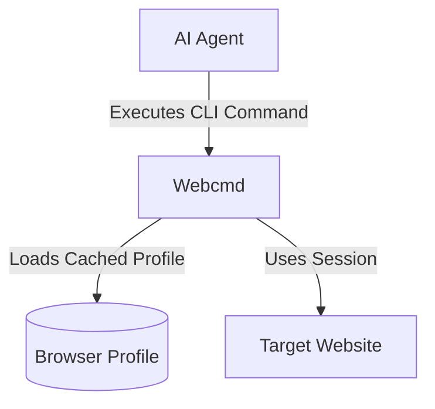
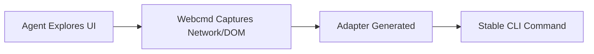

# Turn Your X Session into a CLI for AI Agents

## Overview

AI agents are increasingly used to automate research, monitor trends, and interact with social platforms. However, relying on an agent to open a browser, log in, navigate a complex UI, and parse the DOM every single time is highly inefficient.

Repeatedly exploring the same browser workflow wastes valuable time and AI tokens. It introduces latency, increases the likelihood of failures due to minor layout changes, and forces you to repeatedly deal with CAPTCHAs and session timeouts.

Webcmd is designed specifically for browser workflows and authenticated sessions. It solves this problem by allowing you to authenticate once, execute the workflow, and then wrap that interaction into a reusable CLI command.

## What You'll End Up With

Instead of asking your AI agent to repeatedly navigate X, you'll be able to run reusable commands like:

```bash
webcmd x bookmarks
webcmd x profile openai
webcmd x search "browser automation"
```

These commands can be executed directly by AI agents, scripts, or CI pipelines without repeating browser exploration.

## Why Not Just Write a Playwright Script?

When automating web workflows, developers often reach for Puppeteer or Playwright. However, building and maintaining custom automation scripts has significant hidden costs:

- **Brittle Selectors:** Modern web applications frequently update their DOM structures and CSS classes, instantly breaking hardcoded selectors.
- **Maintenance Costs:** Every custom script requires dedicated error handling, retry logic, and boilerplate parsing.
- **Repeated Login:** Scripts typically boot a fresh, empty browser profile. This forces you to repeatedly handle passwords, 2FA, and authentication flows on every run.

Webcmd abstracts away these maintenance costs. It persists browser state for you and provides a standardized way to convert successful browser interactions into declarative, stable commands.

## Prerequisites

- Node.js 20 or newer
- Webcmd installed globally (`npm install -g @agentrhq/webcmd`)
- An active X account
- A terminal where your AI agent can execute commands

## Step 1

Create an authenticated browser profile.

Webcmd uses named browser profiles to securely maintain login state. Instead of hardcoding credentials, you log in interactively once. Ask your agent:

```text
Use Webcmd to open a foreground browser with a profile named 'social'. Wait for me to log in to X.
```

A Chromium window will appear. Complete the standard login process and handle any 2FA prompts. Your session cookies are now securely cached in the `social` profile.

## Step 2

Reuse the browser session.

Now that the profile is authenticated, you can instruct your agent to use it for data extraction without repeating the login flow.

```text
Use the 'social' profile in Webcmd to navigate to my X bookmarks. Extract the first 5 bookmarks as a JSON array.
```

Webcmd will launch the browser using your cached session. It bypasses the login screen completely and goes straight to the requested workflow.



## Step 3

Generate reusable commands.

Once the agent successfully extracts the data, turn that ephemeral workflow into a permanent CLI command. Ask the agent to author an adapter:

```text
Create a private Webcmd adapter for X bookmarks.
Command: webcmd x bookmarks
Profile: 'social'
Output: JSON array with text, author, and url.
Verify the command works.
```

> 💡 **Think of adapters as reusable skills your AI agent can execute on demand.**

The agent will write an adapter (saved in `~/.webcmd/clis/x/bookmarks.js`) that formalizes how the data is fetched.



## Step 4

Execute commands.

Your agent (or any other tool sharing the environment) can now execute the command instantly.

```bash
webcmd x bookmarks -f json
```

Because the adapter defines a highly specific strategy (like intercepting the exact background API request for bookmarks), Webcmd can fetch the data quickly without necessarily rendering the full page.

## Expected Output

The command returns clean, structured JSON designed for machine consumption:

```json
[
  {
    "author": "@agentrhq",
    "text": "Announcing Webcmd v0.2.1...",
    "url": "https://x.com/agentrhq/status/12345"
  }
]
```

## How It Works

To understand why this is more reliable than standard scripting, let's look under the hood:

- **Browser Sessions:** Webcmd locally manages Chromium profiles. When you specify a profile, Webcmd mounts that exact directory, injecting the valid cookies and session tokens automatically.
- **Adapters:** An adapter is the underlying code that defines the command. It tells Webcmd exactly *how* to retrieve the data (e.g., via the `COOKIE`, `INTERCEPT`, or `UI` strategies).
- **Generated CLIs:** Formalizing workflows into CLIs means agents can discover them natively using `webcmd list -f json`. They don't need to write code to fetch data; they just execute the available commands.

## Applying This Pattern Elsewhere

The pattern of authenticating once and generating an adapter works for virtually **any authenticated website**. You can use Webcmd to build stable CLIs for:

- **Internal Dashboards:** Extract metrics from Grafana or Datadog without wrangling API tokens.
- **Jira:** Update tickets or fetch sprint progress using your existing SSO session.
- **SAP:** Automate heavy enterprise accounting software that lacks accessible APIs.
- **Salesforce:** Extract leads or update records without hitting API rate limits.
- **Legacy Enterprise Software:** Wrap ancient intranet portals into modern JSON interfaces.

> 💡 **This guide uses X as an example.**
>
> The same workflow applies to Jira, Salesforce, SAP, Grafana, internal dashboards, banking portals, and virtually any authenticated website.

## Why This Matters for AI Agents

The first run teaches Webcmd how to perform the task.

Future runs simply execute a stable command.

Instead of repeatedly reasoning about the UI, the agent executes a deterministic interface.

## Next Steps

Now that you understand how to turn an authenticated session into a CLI, explore these related concepts:

- [Concepts](/concepts) - Learn more about Adapters and Strategies.
- [Authoring](/authoring) - Learn how to instruct agents to build perfect adapters.
- [Generated CLIs](/generated-clis) - Understand how generated commands are stored and managed.
