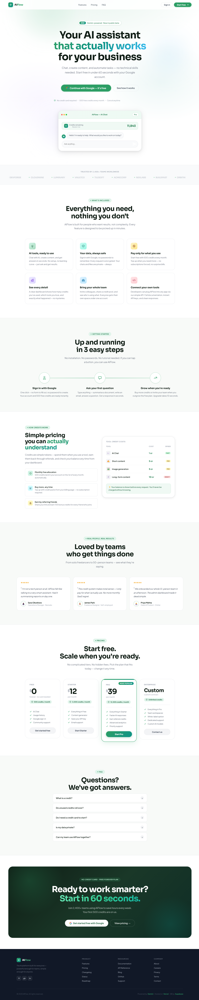

# Universal QA Audit Report
**Base URL:** `https://magical-bombolone-f9fbf8.netlify.app/#`

## Page: https://magical-bombolone-f9fbf8.netlify.app/#
* **HTTP Status:** 200
* **Security headers missing:** content-security-policy, x-frame-options, x-content-type-options
* **Broken images:** 0
* **Mixed content (http on https):** 0
* **Accessibility issues found:** 2
* **Horizontal overflow on:** none
* **Forms found:** 1
* **Dead clickables:** 20 / 30 scanned

| Tag | Label | Suggested Fix |
|---|---|---|
| A | AIFlow | Anchor 'AIFlow' fired no navigation/network/DOM change. Check for a placeholder href (e.g. href='#') or a JS onclick handler that isn't actually wired up. |
| A | Sign in | Anchor 'Sign in' fired no navigation/network/DOM change. Check for a placeholder href (e.g. href='#') or a JS onclick handler that isn't actually wired up. |
| A | Continue with Google — it's free | Anchor 'Continue with Google — it's free' fired no navigation/network/DOM change. Check for a placeholder href (e.g. href='#') or a JS onclick handler that isn't actually wired up. |
| A | Start Starter | Anchor 'Start Starter' fired no navigation/network/DOM change. Check for a placeholder href (e.g. href='#') or a JS onclick handler that isn't actually wired up. |
| A | Start Pro | Anchor 'Start Pro' fired no navigation/network/DOM change. Check for a placeholder href (e.g. href='#') or a JS onclick handler that isn't actually wired up. |
| A | Contact us | Anchor 'Contact us' fired no navigation/network/DOM change. Check for a placeholder href (e.g. href='#') or a JS onclick handler that isn't actually wired up. |
| A | gh | Anchor 'gh' fired no navigation/network/DOM change. Check for a placeholder href (e.g. href='#') or a JS onclick handler that isn't actually wired up. |
| A | in | Anchor 'in' fired no navigation/network/DOM change. Check for a placeholder href (e.g. href='#') or a JS onclick handler that isn't actually wired up. |
| A | Features | Anchor 'Features' fired no navigation/network/DOM change. Check for a placeholder href (e.g. href='#') or a JS onclick handler that isn't actually wired up. |
| A | Pricing | Anchor 'Pricing' fired no navigation/network/DOM change. Check for a placeholder href (e.g. href='#') or a JS onclick handler that isn't actually wired up. |
| A | Changelog | Anchor 'Changelog' fired no navigation/network/DOM change. Check for a placeholder href (e.g. href='#') or a JS onclick handler that isn't actually wired up. |
| A | Status | Anchor 'Status' fired no navigation/network/DOM change. Check for a placeholder href (e.g. href='#') or a JS onclick handler that isn't actually wired up. |
| A | Roadmap | Anchor 'Roadmap' fired no navigation/network/DOM change. Check for a placeholder href (e.g. href='#') or a JS onclick handler that isn't actually wired up. |
| A | Documentation | Anchor 'Documentation' fired no navigation/network/DOM change. Check for a placeholder href (e.g. href='#') or a JS onclick handler that isn't actually wired up. |
| A | API Reference | Anchor 'API Reference' fired no navigation/network/DOM change. Check for a placeholder href (e.g. href='#') or a JS onclick handler that isn't actually wired up. |
| A | Blog | Anchor 'Blog' fired no navigation/network/DOM change. Check for a placeholder href (e.g. href='#') or a JS onclick handler that isn't actually wired up. |
| A | GitHub | Anchor 'GitHub' fired no navigation/network/DOM change. Check for a placeholder href (e.g. href='#') or a JS onclick handler that isn't actually wired up. |
| A | Support | Anchor 'Support' fired no navigation/network/DOM change. Check for a placeholder href (e.g. href='#') or a JS onclick handler that isn't actually wired up. |
| A | About | Anchor 'About' fired no navigation/network/DOM change. Check for a placeholder href (e.g. href='#') or a JS onclick handler that isn't actually wired up. |
| A | Careers | Anchor 'Careers' fired no navigation/network/DOM change. Check for a placeholder href (e.g. href='#') or a JS onclick handler that isn't actually wired up. |

## Proof of Execution
